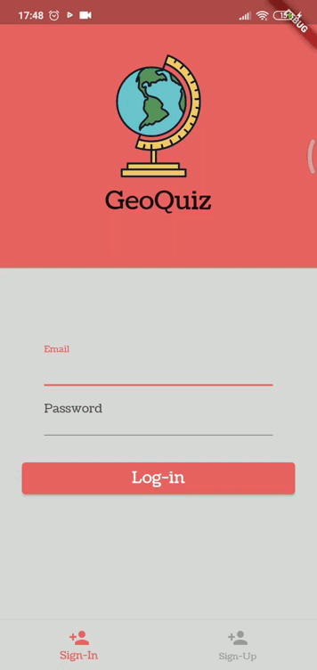
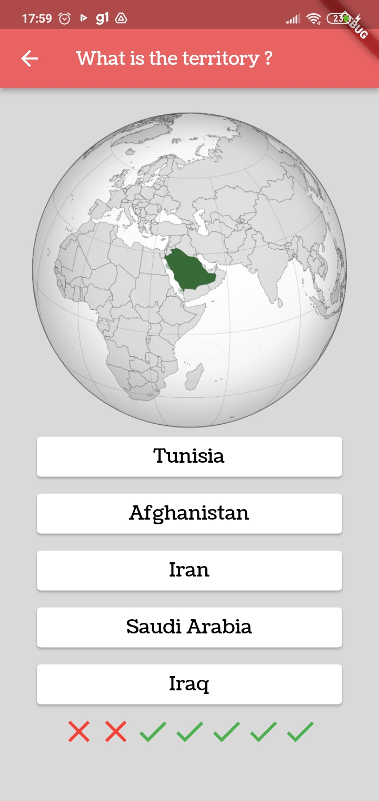
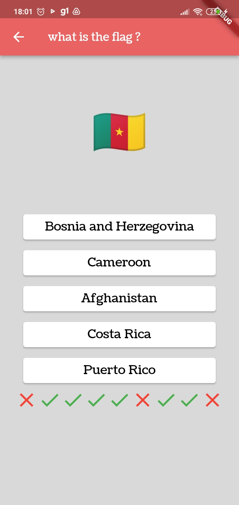
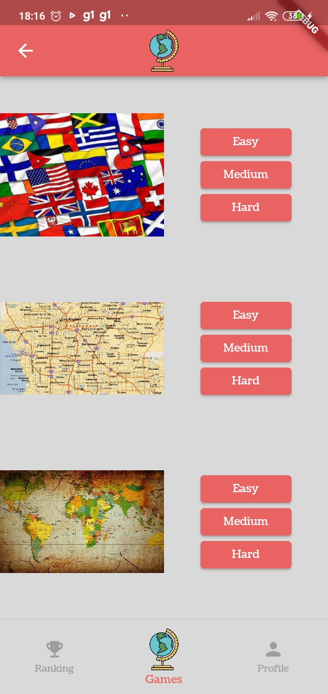

# GeoQuiz

## Sobre
Aos 5 anos de idade Magnus Carlsen memorizou a superfície, população e as capitais de todos os países, anos mais tarde esse jovem viria a se tornar para muitos o maior jogador de xadrez de todos os tempos

<p align="center">
   
</p>


- Vivemos na era da comunicação, e é cada vez mais nos exigido se manter atualizado não só sobre nossa cidade mas sobre os mais diversos países do globo o tempo todo, (pois como diria o ditado "Sem geografia, você não está em lugar nenhum")
- *Ok, Ok, Entendi, mas como faço para compreender todas as informações se não mando bem em geografia?*
- Não tema! para isso surgiu o GeoQuiz, um site onde você pode testar e praticar seus conhecimentos sobre o tema, será que você consegue chegar ao top #1 do nosso placar diário?
- No total foram 60 territórios, 164 capitais de países e 247 bandeiras cadastradas no banco de dados
- Habilite a opção instalar apps de fontes desconhecidas em seu smartphone


- [instale meu apk aqui](https://drive.google.com/file/d/1dwillQH9LY5sHw77KzUc9we5yST8db5H/view?usp=share_link)
- [veja meu repositório web dessa aplicação aqui](https://github.com/marcojr73/projeto22-geoQuiz)
- [veja meu repositório back end dessa aplicação aqui](https://github.com/marcojr73/projeto22-geoQuiz-API)

***

## Iniciando

Este projeto é um ponto de partida para uma aplicação Flutter.

Alguns recursos para você começar se este for seu primeiro projeto Flutter:

- [Lab: Write your first Flutter app](https://docs.flutter.dev/get-started/codelab)
- [Cookbook: Useful Flutter samples](https://docs.flutter.dev/cookbook)

Para obter ajuda para começar com o desenvolvimento do Flutter, veja o
[documentação online](https://docs.flutter.dev/), que oferece tutoriais,
amostras, orientação sobre desenvolvimento móvel e uma referência completa da API.

Instale meu projeto e suas dependências

```bash
  git clone git@github.com:marcojr73/Geo-Quiz-flutter.git

  flutter doctor
```

***

## Demonstração

<p align="center">
   
   
   
   
</p>


***

## Funcionalidades

- Gerenciamento de estados
- Shared Preferences
- Consumo api e gerenciamento assíncrono
- Sign-up e sign-in
- Tratamento de erros
- Rotas nomeadas
- TabBar inferior

***